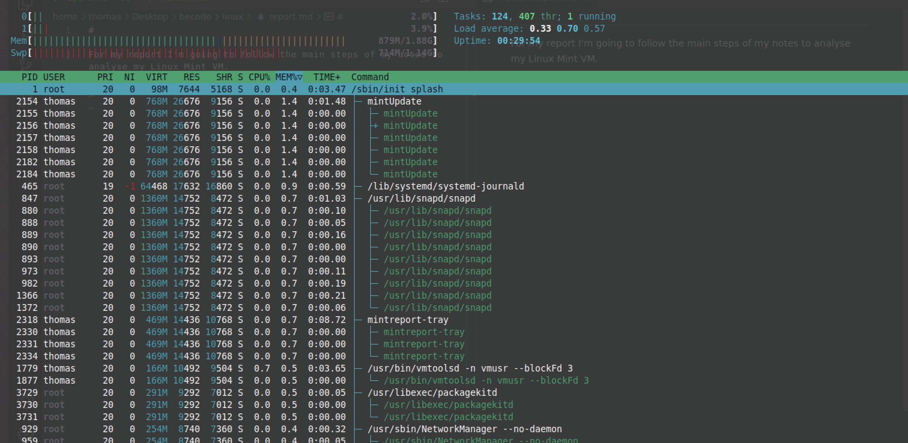
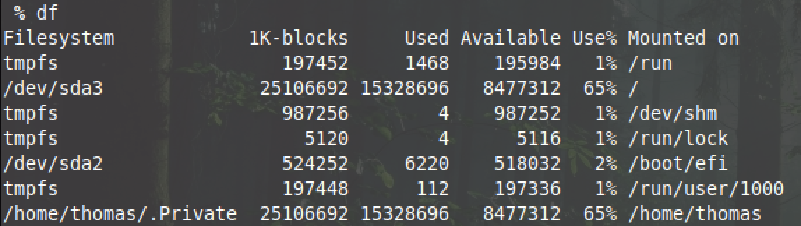
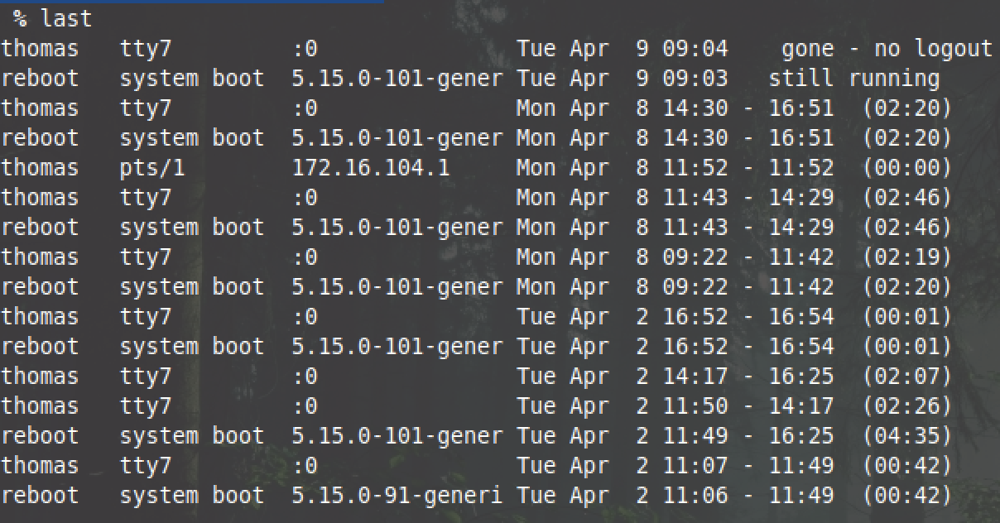
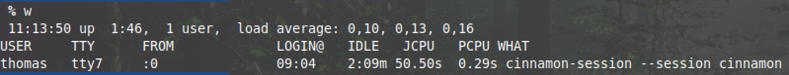
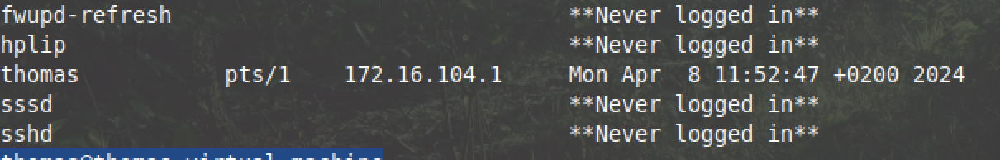
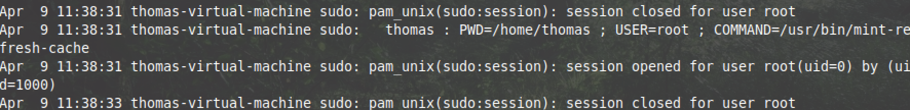
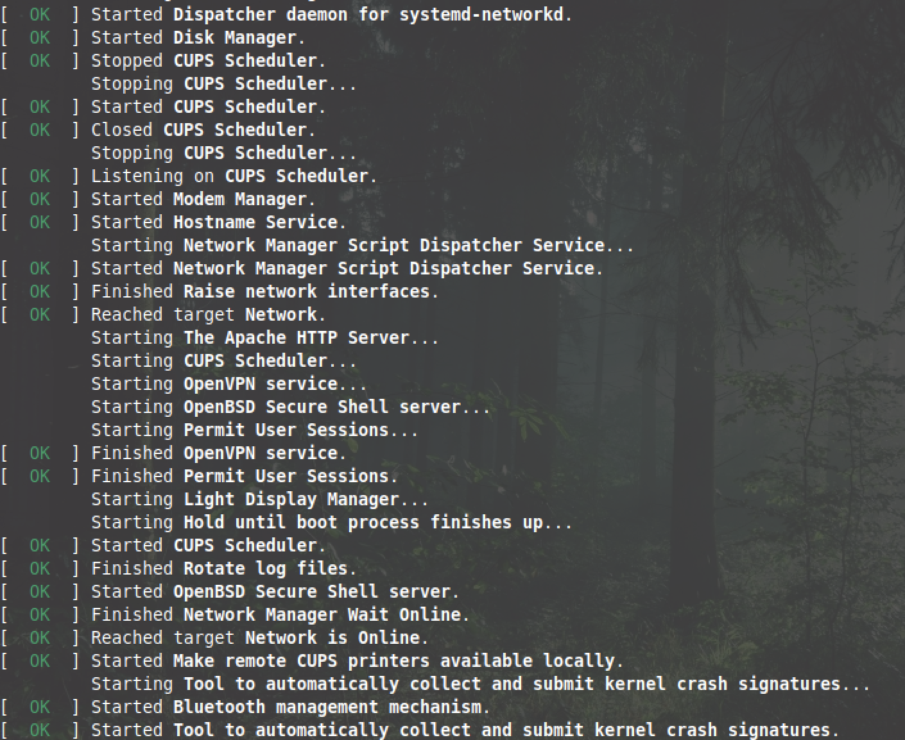
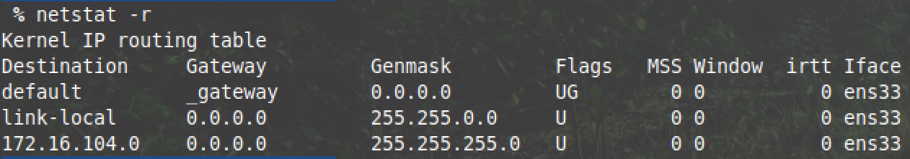
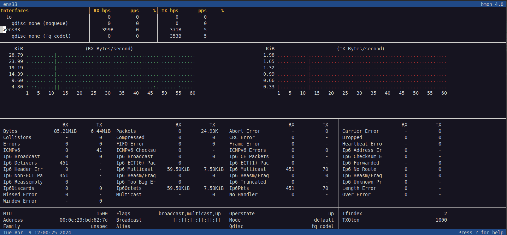
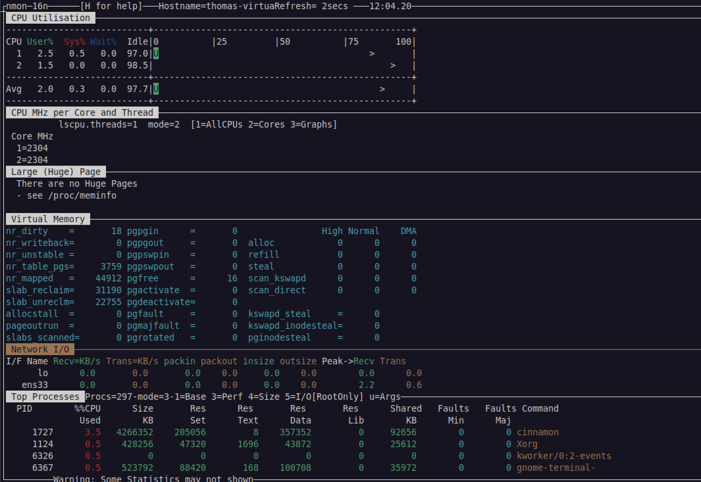

# Report Monitoring

For my report I'm going to follow the main steps of my notes to analyze my Linux Mint VM.


<br>

## CPU


I used the command:

```bash
    top
```

Then press SHIFT + M to show the most consuming PID.
We can see here that cinnamon is first, which is my desktop environment with 2.7% of the CPU.
When I was using Chrome it quickly became the first with 10/30% CPU usage, but that goes back to 0 really fast when switching tab and not using it actively so we don't see it here.
The second and the rest are only at 0.3% or less, so that's not at all. It's normal since I don't use any consuming apps. That show us that the CPU is not overloaded with lots of stuff right now.
We can also see which users belong to those PIDs.

<br>

## Memory



For the memory I used

```bash
    htop
```

We can see that mintupdate is #1 with 1.4 of memory. It's the PID that manage software to update on Mint. Followed by systemd-journald that collects and stores logging data with 0.9. Rest are not really expensive (same for CPU) since not much is running or using memory and CPU.

<br>

## Disk Space

I used:

```bash
    df
```

to see disk space available in the system



sda3 use the most space since it's my main storage. (65%) the rest are way smaller: boot, /run, etc.

<br>

## Last log / Auth

```bash
    last
```

Will simply print the log in / log out.



<br>

```bash
    w
```

Can be used to see the currently logged-in users and what they are doing



Another useful command is:

```bash
    lastlog
```

To see last logged users



We can see here that thomas with IP 172.16.104.1 connected on Mon Apr 8 at 11. It was me through ssh from my computer.

<br>

We can use some more commands:

```bash
    uptime
```

to see uptime of the machine: currently 1:55

<br>

To see all the process running

```bash
    ps aux
```
<br>

## Logs

Let's analyze some logs files now to see what is happening

- /var/log/syslog: but there's a lot of data and unless you know what you are looking for it will be long to analyze.

- /var/log/auth: we can see the last log in to the root user when I was prompted to use super user to do something.



- /var/log/boot: We can see there if everything was fine during the boot of the machine.



We can also type the command

```bash
    grep CRON /var/log/syslog
```

to see the CRON running and if nothing is suspicious.

<br>

## Network

We will now look at our network to see what is happening and if everything is fine.


I used:

```bash
    netstat -r
```

To see the Kernel IP routing table.



We can also use bmon to analyze more details:



Additionally, we can use nmon to do a lot of things we did previously like analyzing network, CPU, disk, etc.

<br>

```bash
 nmon
```



We can go further in details if you really want to monitor your system in depth but we here got a good basic report of how to monitor a Linux VM.
